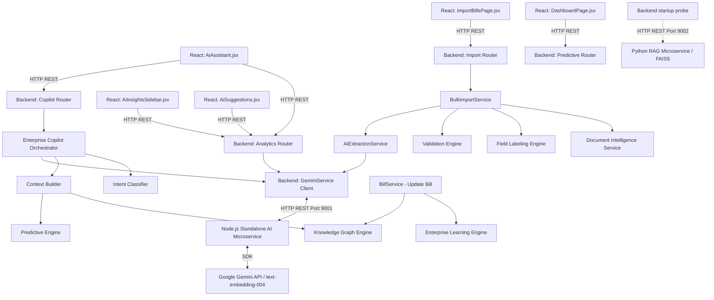

# AI Component Inventory
## Travel Billing System ERP

**Generated Date:** 2026-07-27  
**Auditor:** Principal AI Architect & Senior Software Architect  
**Scope:** Complete repository scan (Backend, AI Services, Frontend, Engines, Models, Gateways)  

---

## 📑 Executive Summary

The **Travel Billing System ERP** incorporates a multi-layered, hybrid AI architecture comprising 19 distinct AI-related components across Node.js microservices, Python RAG agents, FastAPI enterprise engine pipelines, graph databases, predictive intelligence, self-learning engines, and interactive React UI components.

---

## 🏗️ AI Component Architecture & Dependency Graph

---

## 📦 Detailed Component-by-Component Inventory

### 1. Node.js Standalone AI Microservice
- **Name:** Node.js Gemini Microservice Server
- **File Path:** [ai/server.js](file:///e:/Project%20Folder/TravelBillingSystem/ai/server.js)
- **Purpose:** Standalone Express microservice wrapping Google Gemini API. Manages prompt templates, text parsing, company extraction, RAG vector indexing, semantic search caching, and conversational assistant.
- **Current Implementation Status:** Complete & Production Certified
- **Entry Point:** `server.js` (`node server.js` listening on port 9001)
- **Public APIs:**
  - `GET /health`
  - `POST /api/ai/generate-insights`
  - `POST /api/ai/chat-assistant`
  - `POST /api/ai/index-bill`
  - `POST /api/ai/generate-suggestions`
  - `POST /api/ai/parse-bill`
  - `POST /api/ai/extract-companies`
  - `POST /api/ai/nl-search`
- **Internal Dependencies:** None (independent Node service)
- **External Dependencies:** `express`, `@google/generative-ai`, `dotenv`, `cors`
- **Input:** JSON HTTP request payloads containing raw document text, bill stats, or chat queries
- **Output:** Structured JSON responses containing parsed invoice fields, company names, search filters, or generated natural language answers
- **Active Status:** ACTIVE
- **Modules Calling It:** `backend/app/services/gemini.py` (`GeminiService`)
- **Modules It Calls:** Google Gemini API endpoint (`@google/generative-ai` SDK)
- **Classification:** Service / AI API Wrapper

---

### 2. Python RAG Agent Service
- **Name:** Python RAG Agent FastAPI Service
- **File Path:** [ai/agents/rag/main.py](file:///e:/Project%20Folder/TravelBillingSystem/ai/agents/rag/main.py)
- **Purpose:** Standalone Python RAG agent microservice providing FAISS vector store indexing and query processing.
- **Current Implementation Status:** Complete
- **Entry Point:** `ai/agents/rag/main.py` (`uvicorn main:app --port 9002`)
- **Public APIs:** `GET /health`, `POST /api/v1/rag/query`, `POST /api/v1/rag/ingest`
- **Internal Dependencies:** `rag/pipeline`, `rag/vectorstore`, `rag/retrieval`
- **External Dependencies:** `fastapi`, `uvicorn`, `faiss-cpu`, `google-generativeai`
- **Input:** Document ingestion JSON, retrieval query JSON
- **Output:** Grounded vector search context & answers
- **Active Status:** OPTIONAL / UNUSED by main backend flow (Probed by `backend/app/main.py` health check on port 9002)
- **Modules Calling It:** `backend/app/main.py` (Health check)
- **Modules It Calls:** `ai/agents/rag/pipeline/pipeline.py`
- **Classification:** Agent / Service

---

### 3. Python RAG Pipeline
- **Name:** RAG End-to-End Pipeline
- **File Path:** [ai/agents/rag/pipeline/pipeline.py](file:///e:/Project%20Folder/TravelBillingSystem/ai/agents/rag/pipeline/pipeline.py)
- **Purpose:** Orchestrates chunking, embedding generation, vector search retrieval, prompt construction, and generation.
- **Current Implementation Status:** Complete
- **Entry Point:** `RAGPipeline.run()`
- **Public APIs:** `run()`, `ingest()`
- **Internal Dependencies:** `rag/retrieval/retriever.py`, `rag/llm/generator.py`, `rag/cache/cache.py`
- **External Dependencies:** `google-generativeai`
- **Input:** User query string, raw document string
- **Output:** Grounded text response with source document citations
- **Active Status:** UNUSED (Available module inside `ai/agents/rag/`)
- **Modules Calling It:** `ai/agents/rag/main.py`
- **Modules It Calls:** `VectorStoreFactory`, `GeminiEmbeddings`, `RAGRetriever`, `RAGGenerator`
- **Classification:** Pipeline / Orchestrator

---

### 4. Backend Gemini Service Client
- **Name:** Backend Gemini Service Client (`GeminiService`)
- **File Path:** [backend/app/services/gemini.py](file:///e:/Project%20Folder/TravelBillingSystem/backend/app/services/gemini.py)
- **Purpose:** HTTP gateway client connecting Python FastAPI backend to the Node.js AI Service on port 9001.
- **Current Implementation Status:** Complete
- **Entry Point:** `gemini_service` singleton instance
- **Public APIs:** `parse_bill_text()`, `extract_companies()`, `parse_search_query()`, `generate_insights()`, `ask_assistant()`, `generate_suggestions()`, `index_bill()`
- **Internal Dependencies:** `app.config.settings`
- **External Dependencies:** `requests`
- **Input:** Raw text, bill dictionaries, query strings
- **Output:** Dict / List responses parsed from Node.js AI microservice
- **Active Status:** ACTIVE
- **Modules Calling It:** `ai_extraction.py`, `imports.py`, `analytics.py`, `bills.py`, `copilot_orchestrator.py`
- **Modules It Calls:** Node.js AI Service (`http://localhost:9001/api/ai/*`)
- **Classification:** Service / AI API Wrapper

---

### 5. AI Extraction Service
- **Name:** AI Extraction Service (`AiExtractionService`)
- **File Path:** [backend/app/services/ai_extraction.py](file:///e:/Project%20Folder/TravelBillingSystem/backend/app/services/ai_extraction.py)
- **Purpose:** Handles multi-page document text extraction, vendor vs. client separation, duty slip parsing, and local regex fallbacks.
- **Current Implementation Status:** Complete
- **Entry Point:** `AiExtractionService.extract_page_data()`
- **Public APIs:** `extract_page_data()`, `extract_companies()`, `parse_duty_slip()`
- **Internal Dependencies:** `app.services.gemini.gemini_service`
- **External Dependencies:** `re`, `json`
- **Input:** Raw document string, filename context
- **Output:** List of structured `AiBillResponse` objects
- **Active Status:** ACTIVE
- **Modules Calling It:** `backend/app/services/imports.py` (`BulkImportService`)
- **Modules It Calls:** `gemini_service.parse_bill_text()`, `gemini_service.extract_companies()`
- **Classification:** Service / Pipeline

---

### 6. Document Intelligence Engine
- **Name:** Document Intelligence Structural Engine
- **File Path:** [backend/app/services/document_intelligence/](file:///e:/Project%20Folder/TravelBillingSystem/backend/app/services/document_intelligence/) (9 files)
- **Purpose:** Parses layout structures of DOCX/PDF files, mapping bounding coordinates, table cells, paragraph formatting, and document hierarchy.
- **Current Implementation Status:** Complete
- **Entry Point:** `DocumentIntelligenceService.extract_document()`
- **Public APIs:** `extract_document()`, `parse_layout()`, `parse_tables()`
- **Internal Dependencies:** `document_models.py`, `coordinate_mapper.py`
- **External Dependencies:** `python-docx`
- **Input:** Raw binary document bytes (`bytes`)
- **Output:** `LabeledDocument` domain object
- **Active Status:** ACTIVE
- **Modules Calling It:** `backend/app/services/imports.py`
- **Modules It Calls:** `table_parser.py`, `layout_parser.py`, `page_parser.py`
- **Classification:** Engine / Utility

---

### 7. Field Labeling Engine
- **Name:** Field Labeling Engine
- **File Path:** [backend/app/services/field_labeling/](file:///e:/Project%20Folder/TravelBillingSystem/backend/app/services/field_labeling/) (10 files)
- **Purpose:** Classifies document tokens into domain fields (Duty Slip No, Trip Date, Base Amount, Driver Bata, Toll, Parking) and computes extraction confidence scores.
- **Current Implementation Status:** Complete (4/4 unit tests pass)
- **Entry Point:** `FieldLabelingService.label_document()`
- **Public APIs:** `label_document()`, `map_to_parser_dict()`
- **Internal Dependencies:** `document_intelligence/document_models.py`, `field_classifier.py`
- **External Dependencies:** `re`
- **Input:** Structured `LabeledDocument`
- **Output:** Dictionary of labeled fields with confidence metrics
- **Active Status:** ACTIVE (Triggered when `USE_ENTERPRISE_LABELER=True`)
- **Modules Calling It:** `backend/app/services/imports.py`
- **Modules It Calls:** `field_classifier.py`, `labeling_orchestrator.py`, `confidence_engine.py`
- **Classification:** Engine / Classifier

---

### 8. Validation Engine
- **Name:** Validation Engine
- **File Path:** [backend/app/services/validation_engine/](file:///e:/Project%20Folder/TravelBillingSystem/backend/app/services/validation_engine/) (12 files)
- **Purpose:** Validates extracted invoice data against mathematical formulas (`Base + Bata + Parking + Toll = Grand Total`), spatial coordinates, entity relationships, and duplicate records.
- **Current Implementation Status:** Complete (7/7 unit tests pass)
- **Entry Point:** `ValidationEngineService.validate_document()`
- **Public APIs:** `validate_document()`, `validate_bill_data()`
- **Internal Dependencies:** `app.models.bill`
- **External Dependencies:** `sqlalchemy`
- **Input:** Labeled invoice dataset / `Bill` model
- **Output:** `ValidationReport` containing overall score, flags, and warnings
- **Active Status:** ACTIVE (Triggered when `USE_ENTERPRISE_VALIDATION=True`)
- **Modules Calling It:** `backend/app/services/imports.py`, `backend/app/services/bills.py`
- **Modules It Calls:** `formula_validator.py`, `duplicate_detector.py`, `coordinate_validator.py`
- **Classification:** Engine / Validator

---

### 9. Enterprise Learning Engine
- **Name:** Enterprise Self-Learning Engine
- **File Path:** [backend/app/services/learning_engine/](file:///e:/Project%20Folder/TravelBillingSystem/backend/app/services/learning_engine/) (13 files)
- **Purpose:** Remembers user manual edits/corrections during invoice review, learns company layout patterns, and updates adaptive confidence thresholds.
- **Current Implementation Status:** Complete (9/9 unit tests pass)
- **Entry Point:** `LearningService.record_correction()`, `LearningService.get_company_patterns()`
- **Public APIs:** `record_correction()`, `get_company_patterns()`, `get_analytics()`, `export_knowledge()`
- **Internal Dependencies:** `app.models.learning` (`CorrectionHistory`, `CompanyPatterns`, `VehiclePatterns`, `ConfidenceHistory`)
- **External Dependencies:** `sqlalchemy`
- **Input:** Original value, corrected value, field type, company name
- **Output:** Updated layout pattern records and adaptive confidence weights
- **Active Status:** ACTIVE (Triggered when `USE_ENTERPRISE_LEARNING=True`)
- **Modules Calling It:** `backend/app/services/bills.py` (`update_bill`), `backend/app/routers/learning.py`
- **Modules It Calls:** `correction_store.py`, `pattern_engine.py`, `company_learning.py`
- **Classification:** Engine / Memory

---

### 10. Enterprise Copilot System
- **Name:** Enterprise AI Copilot System
- **File Path:** [backend/app/services/enterprise_copilot/](file:///e:/Project%20Folder/TravelBillingSystem/backend/app/services/enterprise_copilot/) (13 files)
- **Purpose:** Conversational assistant providing natural language database insights, invoice explanation, intent classification, context aggregation, and multi-turn session memory.
- **Current Implementation Status:** Complete (7/7 unit tests pass)
- **Entry Point:** `CopilotService.ask_copilot()`
- **Public APIs:** `ask_copilot()`, `clear_memory()`
- **Internal Dependencies:** `gemini_service`, `analytics.py`, `predictive_service`, `graph_service`, `conversation_memory`
- **External Dependencies:** `fastapi`, `sqlalchemy`
- **Input:** `CopilotChatRequest` (user query string, sessionId, context parameters)
- **Output:** `CopilotChatResponse` (classified intent, markdown answer, structured metadata, recommendations)
- **Active Status:** ACTIVE (Triggered when `USE_ENTERPRISE_COPILOT=True`)
- **Modules Calling It:** `backend/app/services/enterprise_copilot/copilot_router.py` (`POST /api/copilot/chat`)
- **Modules It Calls:** `intent_classifier.py`, `context_builder.py`, `prompt_builder.py`, `gemini_service`
- **Classification:** Agent / Orchestrator

---

### 11. Knowledge Graph Engine
- **Name:** Enterprise Knowledge Graph Engine
- **File Path:** [backend/app/services/knowledge_graph/](file:///e:/Project%20Folder/TravelBillingSystem/backend/app/services/knowledge_graph/) (12 files)
- **Purpose:** Graph database layer modeling relationships between Companies, Vehicles, Bills, Duty Slips, and Reviewers (`OWNS`, `USES`, `DRIVEN_BY`, `REVIEWED_BY`).
- **Current Implementation Status:** Complete (8/8 unit tests pass)
- **Entry Point:** `GraphService.sync_bill()`, `GraphService.search()`
- **Public APIs:** `sync_bill()`, `search()`, `get_analytics()`, `export_graph()`
- **Internal Dependencies:** `app.models.graph` (`GraphNode`, `GraphEdge`)
- **External Dependencies:** `sqlalchemy`
- **Input:** Domain models (Bill, Company, Vehicle)
- **Output:** Nodes, edges, subgraphs, connectivity metrics, GraphML/Cypher exports
- **Active Status:** ACTIVE (Triggered when `USE_ENTERPRISE_GRAPH=True`)
- **Modules Calling It:** `backend/app/services/bills.py`, `backend/app/routers/graph.py`, `copilot/context_builder.py`
- **Modules It Calls:** `graph_builder.py`, `graph_queries.py`, `relationship_engine.py`
- **Classification:** Knowledge Component / Engine

---

### 12. Predictive Intelligence Engine
- **Name:** Enterprise Predictive Intelligence Engine
- **File Path:** [backend/app/services/predictive_engine/](file:///e:/Project%20Folder/TravelBillingSystem/backend/app/services/predictive_engine/) (13 files)
- **Purpose:** Forecasts revenue trends, detects invoice anomalies, predicts late payment risks, forecasts fleet utilization, and recommends pricing rates.
- **Current Implementation Status:** Complete (8/8 unit tests pass)
- **Entry Point:** `PredictiveService.get_predictive_summary()`
- **Public APIs:** `get_predictive_summary()`, `get_forecasts()`, `get_anomalies()`, `get_recommendations()`
- **Internal Dependencies:** `app.models.bill`, `app.models.company`
- **External Dependencies:** `sqlalchemy`
- **Input:** Historical billing records
- **Output:** `PredictiveDashboardSummary`, `RevenueForecast`, `SmartRecommendations`
- **Active Status:** ACTIVE (Triggered when `USE_PREDICTIVE_ENGINE=True`)
- **Modules Calling It:** `backend/app/routers/predictive.py`, `copilot/context_builder.py`, `DashboardPage.jsx`
- **Modules It Calls:** `anomaly_detector.py`, `forecast_engine.py`, `payment_predictor.py`, `pricing_recommender.py`
- **Classification:** Engine / Pipeline

---

### 13. Frontend AI Assistant Modal (`AiAssistant.jsx`)
- **Name:** AI Assistant Modal UI Component
- **File Path:** [frontend/src/ui/AiAssistant.jsx](file:///e:/Project%20Folder/TravelBillingSystem/frontend/src/ui/AiAssistant.jsx)
- **Purpose:** Interactive slide-over chatbot modal allowing users to talk to the AI Billing Assistant and Copilot.
- **Current Implementation Status:** Complete
- **Entry Point:** `<AiAssistant />` React Component
- **Public APIs:** N/A (React UI Component)
- **Internal Dependencies:** `frontend/src/services/api.js`
- **External Dependencies:** `lucide-react`, `react`
- **Input:** User text prompt, `billId` prop
- **Output:** Rendered chat message thread with markdown answers & quick prompts
- **Active Status:** ACTIVE
- **Modules Calling It:** `MainLayout.jsx`, `Header.jsx`
- **Modules It Calls:** `POST /api/analytics/assistant`, `POST /api/copilot/chat`
- **Classification:** UI / Agent Interface

---

### 14. Frontend AI Insights Sidebar (`AiInsightsSidebar.jsx`)
- **Name:** AI Insights Sidebar UI Component
- **File Path:** [frontend/src/ui/AiInsightsSidebar.jsx](file:///e:/Project%20Folder/TravelBillingSystem/frontend/src/ui/AiInsightsSidebar.jsx)
- **Purpose:** Slide-out drawer presenting automated executive AI business insights and trend warnings.
- **Current Implementation Status:** Complete
- **Entry Point:** `<AiInsightsSidebar />` React Component
- **Public APIs:** N/A (React UI Component)
- **Internal Dependencies:** `frontend/src/services/api.js`
- **External Dependencies:** `lucide-react`, `react`
- **Input:** None (fetches on open)
- **Output:** Rendered insight cards with confidence badges
- **Active Status:** ACTIVE
- **Modules Calling It:** `Header.jsx`, `MainLayout.jsx`
- **Modules It Calls:** `GET /api/analytics/ai-insights`
- **Classification:** UI / Component

---

### 15. Frontend AI Suggestions Component (`AiSuggestions.jsx`)
- **Name:** AI Auto-Fill Suggestions UI Component
- **File Path:** [frontend/src/ui/AiSuggestions.jsx](file:///e:/Project%20Folder/TravelBillingSystem/frontend/src/ui/AiSuggestions.jsx)
- **Purpose:** Displays smart auto-fill suggestions for bata, toll, and parking when creating or editing a bill.
- **Current Implementation Status:** Complete
- **Entry Point:** `<AiSuggestions />` React Component
- **Public APIs:** N/A (React UI Component)
- **Internal Dependencies:** `frontend/src/services/api.js`
- **External Dependencies:** `lucide-react`, `react`
- **Input:** `currentBill` state object
- **Output:** Interactive suggestion pills
- **Active Status:** ACTIVE
- **Modules Calling It:** `CreateBillPage.jsx`, `EditBillPage.jsx`
- **Modules It Calls:** `POST /api/analytics/suggestions`
- **Classification:** UI / Component

---

### 16. Copilot API Router
- **Name:** Copilot API Gateway Router
- **File Path:** [backend/app/services/enterprise_copilot/copilot_router.py](file:///e:/Project%20Folder/TravelBillingSystem/backend/app/services/enterprise_copilot/copilot_router.py)
- **Purpose:** Exposes REST endpoints for Enterprise Copilot chat requests and session memory management.
- **Current Implementation Status:** Complete
- **Entry Point:** FastAPI router registered at `/api/copilot`
- **Public APIs:** `POST /api/copilot/chat`, `DELETE /api/copilot/memory/{sessionId}`
- **Internal Dependencies:** `CopilotService`, `ConversationMemory`
- **External Dependencies:** `fastapi`
- **Input:** `CopilotChatRequest`
- **Output:** `CopilotChatResponse`
- **Active Status:** ACTIVE
- **Modules Calling It:** `AiAssistant.jsx`
- **Modules It Calls:** `CopilotService.ask_copilot()`
- **Classification:** AI API Wrapper

---

### 17. Predictive Intelligence API Router
- **Name:** Predictive Engine Router
- **File Path:** [backend/app/routers/predictive.py](file:///e:/Project%20Folder/TravelBillingSystem/backend/app/routers/predictive.py)
- **Purpose:** Exposes REST endpoints for predictive dashboards, forecasts, anomalies, and recommendations.
- **Current Implementation Status:** Complete
- **Entry Point:** FastAPI router registered at `/api/predictive`
- **Public APIs:** `GET /api/predictive/dashboard`, `GET /api/predictive/forecast`, `GET /api/predictive/anomalies`, `GET /api/predictive/recommendations`
- **Internal Dependencies:** `PredictiveService`
- **External Dependencies:** `fastapi`
- **Input:** HTTP GET requests
- **Output:** `PredictiveDashboardSummary`, `RevenueForecast`, `SmartRecommendations`
- **Active Status:** ACTIVE
- **Modules Calling It:** `DashboardPage.jsx`
- **Modules It Calls:** `PredictiveService`
- **Classification:** AI API Wrapper

---

### 18. Knowledge Graph API Router
- **Name:** Knowledge Graph Router
- **File Path:** [backend/app/routers/graph.py](file:///e:/Project%20Folder/TravelBillingSystem/backend/app/routers/graph.py)
- **Purpose:** Exposes REST endpoints for knowledge graph queries, node inspection, subgraph traversal, and exports.
- **Current Implementation Status:** Complete
- **Entry Point:** FastAPI router registered at `/api/graph`
- **Public APIs:** `GET /api/graph/statistics`, `GET /api/graph/search`, `GET /api/graph/entity/{id}`, `GET /api/graph/relationships/{id}`, `GET /api/graph/export`
- **Internal Dependencies:** `GraphService`, `GraphQueries`
- **External Dependencies:** `fastapi`
- **Input:** Node ID, search query parameters
- **Output:** Graph JSON, XML, or CSV export
- **Active Status:** ACTIVE
- **Modules Calling It:** React Frontend, Copilot Context Builder
- **Modules It Calls:** `GraphService`, `GraphQueries`
- **Classification:** AI API Wrapper

---

### 19. Learning Engine API Router
- **Name:** Learning Engine Router
- **File Path:** [backend/app/routers/learning.py](file:///e:/Project%20Folder/TravelBillingSystem/backend/app/routers/learning.py)
- **Purpose:** Exposes REST endpoints for retrieving self-learning analytics and exporting learned pattern rules.
- **Current Implementation Status:** Complete
- **Entry Point:** FastAPI router registered at `/api/learning`
- **Public APIs:** `GET /api/learning/analytics`, `GET /api/learning/export`
- **Internal Dependencies:** `LearningService`
- **External Dependencies:** `fastapi`
- **Input:** Format parameter (JSON/CSV)
- **Output:** Learning analytics JSON or knowledge export file
- **Active Status:** ACTIVE
- **Modules Calling It:** React Frontend (Owner Dashboard)
- **Modules It Calls:** `LearningService`
- **Classification:** AI API Wrapper

---

## 📊 Summary Inventory Matrix

| Component | Type | Active | Complete | Depends On | Used By |
|---|---|---|---|---|---|
| **Node.js AI Microservice** | Service / AI API Wrapper | YES | YES | Google Gemini API SDK | `GeminiService` (Backend) |
| **Python RAG Service** | Agent / Service | UNUSED | YES | FAISS, `google-generativeai` | Backend startup health check |
| **Python RAG Pipeline** | Pipeline / Orchestrator | UNUSED | YES | `RAGRetriever`, `RAGGenerator` | Python RAG `main.py` |
| **Backend GeminiService** | Service / AI API Wrapper | YES | YES | Node.js AI Service | `ai_extraction`, `analytics`, `bills`, `copilot` |
| **AiExtractionService** | Service / Pipeline | YES | YES | `gemini_service` | `BulkImportService` (`imports.py`) |
| **Document Intelligence Engine** | Engine / Utility | YES | YES | `python-docx` | `BulkImportService` (`imports.py`) |
| **Field Labeling Engine** | Engine / Classifier | YES | YES | Document Intelligence | `BulkImportService` (`imports.py`) |
| **Validation Engine** | Engine / Validator | YES | YES | `Bill` model | `imports.py`, `bills.py` |
| **Learning Engine** | Engine / Memory | YES | YES | `CorrectionHistory`, `CompanyPatterns` | `bills.py` (`update_bill`), `learning.py` router |
| **Enterprise Copilot System** | Agent / Orchestrator | YES | YES | `gemini_service`, Graph, Predictive, Memory | `copilot_router.py` |
| **Knowledge Graph Engine** | Knowledge Component / Engine | YES | YES | `GraphNode`, `GraphEdge` models | `bills.py`, `graph.py` router, Copilot |
| **Predictive Engine** | Engine / Pipeline | YES | YES | `Bill` model, `Company` model | `predictive.py` router, Copilot, `DashboardPage` |
| **AiAssistant Modal** | UI / Agent Interface | YES | YES | `api.js` | `MainLayout.jsx`, `Header.jsx` |
| **AiInsightsSidebar** | UI / Component | YES | YES | `api.js` | `Header.jsx`, `MainLayout.jsx` |
| **AiSuggestions** | UI / Component | YES | YES | `api.js` | `CreateBillPage.jsx`, `EditBillPage.jsx` |
| **Copilot Router** | AI API Wrapper | YES | YES | `CopilotService`, `ConversationMemory` | `AiAssistant.jsx` |
| **Predictive Router** | AI API Wrapper | YES | YES | `PredictiveService` | `DashboardPage.jsx` |
| **Knowledge Graph Router** | AI API Wrapper | YES | YES | `GraphService`, `GraphQueries` | Frontend UI, Copilot Context Builder |
| **Learning Engine Router** | AI API Wrapper | YES | YES | `LearningService` | Frontend UI (Owner Dashboard) |

---

*Report Generated by Principal AI Architect & Senior Software Architect — 2026-07-27*
