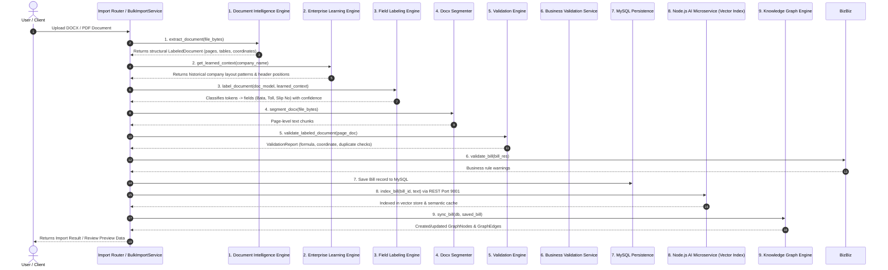

# AI Orchestration Analysis
## Travel Billing System ERP

**Generated Date:** 2026-07-27  
**Auditor:** Principal AI Systems Architect  
**Scope:** Architecture Analysis & Execution Flow Trace (Document Ingestion, Review, Copilot, Analytics)  

---

## 1. Document Upload AI Execution Sequence

When a document is uploaded for parsing/import (`BulkImportService.import_bills` / `parse_bills_only`), the execution sequence across AI components is strictly deterministic and step-by-step:



### Detailed Execution Trace:

1. **FIRST Component:** **Document Intelligence Engine** ([document_intelligence/](file:///e:/Project%20Folder/TravelBillingSystem/backend/app/services/document_intelligence/))
   - *Action:* Parses raw binary document bytes into a structural `LabeledDocument` containing hierarchy, page numbers, paragraph text, table cells, font styles, and spatial bounding boxes.
2. **SECOND Component:** **Enterprise Learning Engine** ([learning_engine/](file:///e:/Project%20Folder/TravelBillingSystem/backend/app/services/learning_engine/))
   - *Action:* Queries `CompanyPatterns` and `CorrectionHistory` tables to retrieve historical layout rules, header cell coordinates, and reviewer correction frequencies for the target company.
3. **THIRD Component:** **Field Labeling Engine** ([field_labeling/](file:///e:/Project%20Folder/TravelBillingSystem/backend/app/services/field_labeling/))
   - *Action:* Takes the structural document and learned context, runs classification algorithms (`field_classifier.py`), and maps raw text tokens into standardized billing fields (Duty Slip No, Trip Date, Base Amount, Driver Bata, Toll, Parking).
4. **FOURTH Component:** **Docx Segmenter Service** ([docx_segmenter.py](file:///e:/Project%20Folder/TravelBillingSystem/backend/app/services/docx_segmenter.py))
   - *Action:* Splits multi-page document streams into isolated page-level text chunks for atomic page-by-page processing.
5. **FIFTH Component:** **Validation Engine** ([validation_engine/](file:///e:/Project%20Folder/TravelBillingSystem/backend/app/services/validation_engine/))
   - *Action:* Runs multi-layer checks on page elements: mathematical formula validation (`Base + Bata + Parking + Toll = Grand Total`), spatial coordinate validation, entity relationship validation, and duplicate invoice detection.
6. **SIXTH Component:** **Business Validation Service** ([business_validation_service.py](file:///e:/Project%20Folder/TravelBillingSystem/backend/app/services/business_validation_service.py))
   - *Action:* Applies core business rules (duty slip presence check, mandatory field presence, zero amount checks).
7. **SEVENTH Component:** **Database Persistence Layer** (SQLAlchemy / MySQL)
   - *Action:* Commits validated `Bill` records and line items to MySQL database tables (`bills`, `companies`, `vehicles`).
8. **EIGHTH Component:** **Node.js AI Microservice (Vector Indexer)** ([ai/server.js](file:///e:/Project%20Folder/TravelBillingSystem/ai/server.js))
   - *Action:* Sends saved bill text via HTTP REST (`POST /api/ai/index-bill` on port 9001) to generate embeddings (`text-embedding-004`) and store in the in-memory vector index for semantic search.
9. **NINTH Component:** **Knowledge Graph Engine** ([knowledge_graph/](file:///e:/Project%20Folder/TravelBillingSystem/backend/app/services/knowledge_graph/))
   - *Action:* Constructs and links graph nodes (`bill:123`, `company:Portescap`, `vehicle:KA01EA1234`) and graph edges (`OWNS`, `USES`, `REVIEWED_BY`) in `graph_nodes` and `graph_edges` tables.

---

## 2. Communication & Execution Patterns

### A. Sequentially Executed Components
The entire AI ingestion and review flow runs **100% sequentially and synchronously** within a single Python request-response thread:
- `Document Intelligence -> Learning Engine -> Field Labeling -> Docx Segmenter -> Validation Engine -> Business Validation -> DB Save -> Vector Indexer -> Knowledge Graph Sync`

### B. Parallel Executed Components
- **NONE.** There are zero asynchronous worker queues (Celery, RQ, RabbitMQ, Kafka), zero background tasks (`BackgroundTasks` in FastAPI is not used for AI engines), and zero concurrent multi-threaded execution pipelines. All AI operations block the HTTP request thread sequentially.

### C. Components That Never Communicate
- **Python RAG Microservice (Port 9002) <-> Node.js AI Microservice (Port 9001):** Operate as completely isolated microservices without any cross-communication or shared index sync.
- **Predictive Engine <-> Learning Engine:** Predictive Engine reads raw historical bills directly from the database; it does not consume layout pattern metrics, extraction success rates, or reviewer correction statistics calculated by the Learning Engine.
- **Knowledge Graph Engine <-> Learning Engine:** Knowledge Graph builds relationship nodes from raw DB models, but does not track reviewer correction patterns or learned layout heuristics.
- **Document Intelligence Engine <-> Node.js AI Microservice:** Document Intelligence performs pure Python `python-docx` AST parsing without querying LLM endpoints.

### D. Duplicated Work Between Components
- **Vector Indexing / Embeddings:** Both Node.js AI Microservice (`ai/server.js`) and Python RAG Service (`ai/agents/rag/`) maintain separate vector store indexing pipelines and embedding generation logic.
- **Field Extraction:** Both `AiExtractionService` (LLM prompt + local regex) and `FieldLabelingEngine` (spatial layout + classifier) perform field extraction. When `USE_ENTERPRISE_LABELER=True`, LLM extraction is bypassed, but `AiExtractionService.map_to_bill_response()` is still invoked as a downstream converter.
- **Validation Checks:** Both `ValidationService` (`business_validation_service.py`) and `ValidationEngineService` (`validation_engine/`) independently execute duplicate detection and mandatory field checks.

### E. Missing Information Exchange (Gaps)
- **Predictive Engine <-> Learning Engine:** Predictive forecasting calculates late payment probabilities and company pricing recommendations, but ignores reviewer edit frequencies and extraction confidence scores recorded by the Learning Engine.
- **Knowledge Graph <-> Field Labeling Engine:** Field Labeling identifies company and vehicle names via direct string matching against MySQL tables, but does not query Knowledge Graph relationships (`Company OWNS Vehicle`, `Company USES Route`) to disambiguate ambiguous OCR text.
- **Predictive Engine <-> Validation Engine:** Validation Engine flags mathematical anomalies during document review, but does not feed those anomalies into the Predictive Engine's active anomaly dashboard log.

---

## 3. Existing Orchestration Mechanism

The orchestration mechanism across the system consists of:

1. **Direct Procedural Function Calls:** Hardcoded Python method invocations inside FastAPI route handlers and service classes (`BulkImportService`, `BillService`, `CopilotOrchestrator`).
2. **Synchronous HTTP REST Requests:** Python `requests.post()` calls from `GeminiService` to Node.js AI Microservice (`http://localhost:9001/api/ai/*`) with a 300-second timeout.
3. **Shared MySQL Database:** State persistence and inter-component data sharing via SQLAlchemy ORM tables (`bills`, `graph_nodes`, `company_patterns`, `correction_history`).

> **Summary:** There is **NO** message broker, task queue, event bus, or dynamic agent supervisor.

---

## 4. Multi-Agent System Classification

### **Can this architecture already be considered a Multi-Agent AI System?**

# ❌ **NO**

### **Detailed Architectural Explanation:**

1. **Modular Code vs. Autonomous Agents:**
   The AI components (Document Intelligence, Field Labeling, Validation Engine, Learning Engine, Knowledge Graph Engine, Predictive Engine) are **class libraries and procedural Python services**, not autonomous AI agents. They do not possess independent execution loops, reactive message processing, or goal-seeking autonomy.

2. **Absence of Inter-Agent Communication Protocols:**
   There is no agent communication protocol (e.g. FIPA-ACL, A2A, or JSON-RPC event bus). Components cannot broadcast events, request assistance from peer agents, or negotiate task allocation.

3. **Deterministic Procedural Control Flow:**
   Execution is controlled by static `if/else` statements inside `BulkImportService`:
   ```python
   if settings.USE_ENTERPRISE_LABELER:
       labeled_doc = FieldLabelingService.label_document(...)
   if settings.USE_ENTERPRISE_VALIDATION:
       validation_doc = ValidationEngineService.validate_labeled_document(...)
   ```
   A true Multi-Agent System uses dynamic agent orchestration where an agent supervisor or router determines execution paths based on intermediate reasoning, task state, and agent capabilities.

---

## 5. Missing Orchestration Layer

Because the current architecture relies on synchronous, procedural Python code, the **ONLY missing orchestration layer** is:

### 🎯 **Missing Layer: Asynchronous Event-Driven Agent Orchestration Bus**

Specifically, the system lacks:

1. **An Event Bus / Message Broker (e.g. Redis Pub/Sub, RabbitMQ, or Celery Event Queue):**
   To decouple the monolithic document import process so that Document Parsing, Field Labeling, Validation, Learning, Vector Indexing, and Knowledge Graph Synchronization occur asynchronously via event triggers (`DOCUMENT_UPLOADED`, `FIELDS_LABELED`, `BILL_VALIDATED`, `REVIEW_CORRECTED`).

2. **An Agent Supervisor / Workflow Orchestrator:**
   A central agent coordinator (or State Machine) that manages execution context, handles retries, routes tasks to specialized components dynamically, and passes unified state between engines without blocking HTTP web threads.

---

*Report Generated by Principal AI Systems Architect — 2026-07-27*
