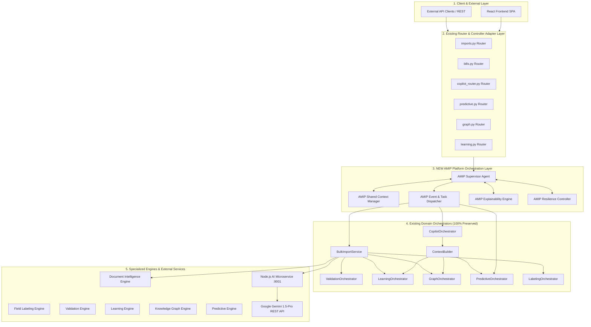
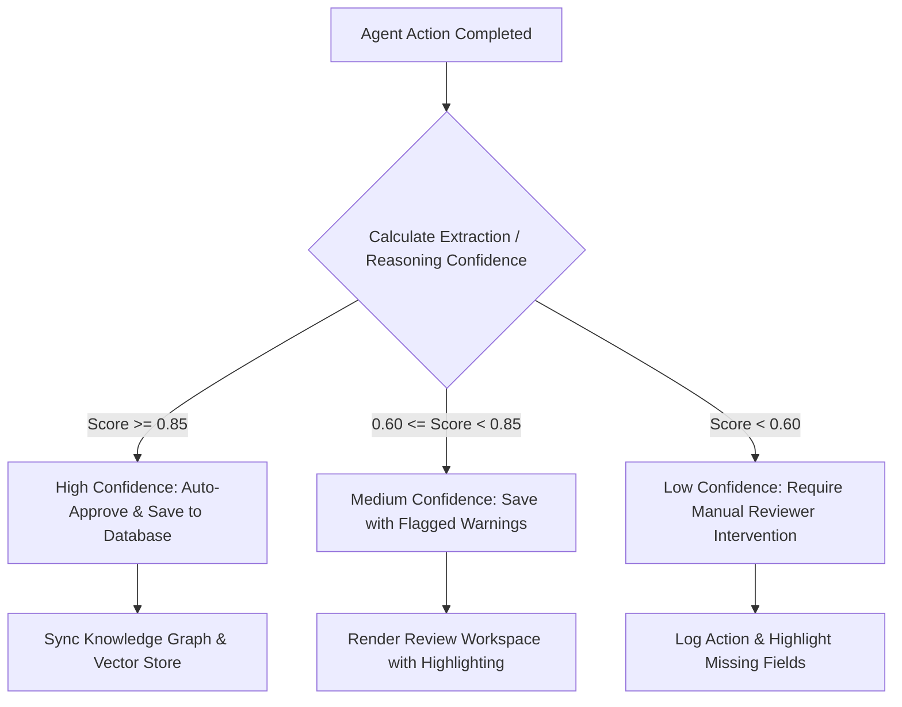

# Enterprise Autonomous Multi-Agent Intelligence Platform (AMIP)
## Architectural Blueprint & Evolution Strategy

**Generated Date:** 2026-07-27  
**Auditor:** Principal AI Platform Architect  
**Constraint Enforced:** 100% Backward Compatibility • Zero Code Modification • Full Preservation of Existing Orchestrators  

---

## 1. High-Level Architecture Blueprint

The **Autonomous Multi-Agent Intelligence Platform (AMIP)** introduces a lightweight, non-invasive orchestration and context abstraction layer *above* the existing domain orchestrators (`CopilotOrchestrator`, `BulkImportService`, `PredictiveOrchestrator`, etc.), transforming procedural backend execution into an autonomous, event-driven, multi-agent intelligence ecosystem.



---

## 2. Execution Lifecycle

The AMIP execution lifecycle governs task requests across six distinct phases:

```
[1. Request Ingestion] ➔ [2. Goal Decomposition] ➔ [3. Agent Task Dispatch] ➔ [4. Domain Execution] ➔ [5. Consensus & Validation] ➔ [6. Response & Learning]
```

1. **Request Ingestion & Adaptation:** Incoming REST requests hit existing FastAPI routers (`imports.py`, `copilot_router.py`). The router wraps request DTOs into a standardized `AMIPTask` wrapper and hands off execution to the `AMIPSupervisorAgent`.
2. **Goal Decomposition & Planning:** The `AMIPSupervisorAgent` analyzes task requirements (e.g. document parsing vs. conversational copilot query vs. forecasting report) and constructs an execution plan mapping necessary sub-tasks to domain orchestrators.
3. **Agent Task Dispatch:** Tasks are dispatched by `AMIPTaskDispatcher` either sequentially or in parallel depending on dependencies.
4. **Domain Execution:** Existing domain orchestrators (`BulkImportService`, `CopilotOrchestrator`, `PredictiveOrchestrator`) execute their respective pipelines without modification.
5. **Consensus & Validation:** The `ValidationOrchestrator` verifies intermediate outputs. If confidence scores fall below threshold (< 0.60), the task is flagged for human review or conditional fallback.
6. **Response Emission & Self-Learning:** Results are returned to the caller while `LearningOrchestrator` and `GraphOrchestrator` asynchronously update pattern stores and relationship nodes.

---

## 3. Agent Communication Flow

Inter-agent communication follows an asynchronous Event-Driven Publish/Subscribe protocol combined with synchronous direct delegation.

### Agent Event Contract (JSON Payload Schema Strategy):

```json
{
  "task_id": "amip-task-89123",
  "trace_id": "trace-7712-4412",
  "source_agent": "LabelingOrchestrator",
  "target_agent": "ValidationOrchestrator",
  "action": "VALIDATE_FIELDS",
  "timestamp": "2026-07-27T12:16:00Z",
  "payload": {
    "document_id": "doc_9912.docx",
    "labeled_fields": { ... },
    "extraction_confidence": 0.92
  },
  "status": "DISPATCHED"
}
```

### Communication Rules:
- **Synchronous Path:** Critical web paths (e.g. instant Copilot chat answers or immediate document upload review previews) execute via direct synchronous agent delegation.
- **Asynchronous Path:** Background indexing, knowledge graph updates, pattern learning, and anomaly forecasting run asynchronously via `AMIPTaskDispatcher` events.

---

## 4. Shared Execution Context

The `AMIPContextManager` maintains a unified, thread-safe memory blackboard (`AMIPExecutionContext`) across the task lifecycle:

### Blackboard Schema Structure:
- **`request_metadata`:** User identity, security role (`OWNER`/`MANAGER`/`EMPLOYEE`), IP address, session ID, feature flag states.
- **`raw_evidence`:** Original document binary bytes, raw OCR text chunks, or user query strings.
- **`extracted_state`:** Intermediate outputs (parsed fields, bounding box coordinates, table layouts).
- **`knowledge_context`:** Aggregated facts retrieved from Knowledge Graph, Company Patterns, and Vehicle Structures via `ContextBuilder`.
- **`agent_provenance`:** Execution history tracking which agents processed the task, their timestamps, confidence ratings, and reasoning trace notes.

---

## 5. Task Routing Strategy

Task routing is dynamically resolved by `AMIPSupervisorAgent` using a three-tier routing policy:

1. **Intent-Based Routing:**
   - Text queries -> `CopilotOrchestrator`
   - Document binaries -> `BulkImportService`
   - Forecast requests -> `PredictiveOrchestrator`
   - Graph queries -> `GraphOrchestrator`
2. **Feature Flag Check:**
   - Evaluates `settings.USE_ENTERPRISE_*` flags. If a flag is disabled, routes payload to legacy fallback paths without crashing.
3. **Role-Based Access Control (RBAC) Guard:**
   - Filters task scope based on user role (`OWNER` has full visibility; `EMPLOYEE` is restricted to self-created records).

---

## 6. Decision Making & Confidence Evaluation Flow



---

## 7. Explainability Flow

The `AMIPExplainabilityEngine` provides total transparency into agent reasoning:

1. **Provenence Graph:** Records every decision step, showing which model/engine produced each value (e.g. `Base Billed Amount` derived via `FieldLabelingEngine` with 94% confidence; `Duty Slip No` parsed via `DocumentIntelligenceService`).
2. **Visual Evidence Mapping:** Links extracted fields back to spatial page coordinates and table bounding boxes.
3. **Rule Justification:** Explains validation failures (e.g., *"Grand Total ₹15,000 does not equal Base ₹12,000 + Bata ₹1,000 + Toll ₹500 (Discrepancy: ₹1,500)"*).

---

## 8. Failure Handling & Degradation Strategy

AMIP enforces a zero-downtime multi-tiered degradation policy:

- **Tier 1 (External LLM Outage):** If Google Gemini API is unreachable (timeout / 5xx / missing key), `AMIPResilienceController` triggers local regex fallbacks (`AiExtractionService`) and returns cached local contextual answers.
- **Tier 2 (Database Connection Failure in Dev):** Server boots in degraded mode, serving mock analytics and logging warnings without crash loops.
- **Tier 3 (Engine Exception):** If an enterprise engine (`FieldLabeling` or `ValidationEngine`) encounters an exception, processing falls back to standard text parsing (`AiExtractionService.extract_page_data`).

---

## 9. Retry & Resilience Strategy

- **Exponential Backoff with Jitter:** External REST requests (Node.js AI microservice or Gemini API) retry up to 3 times with exponential backoff (`1s`, `2s`, `4s` + random jitter).
- **Circuit Breaker:** If an external endpoint fails 5 consecutive times within 60 seconds, `AMIPResilienceController` opens the circuit for 30 seconds, routing all requests directly to local fallback logic.
- **Dead Letter Queue (DLQ):** Non-retryable document parsing errors are stored in `AuditLog` with action `BILL_IMPORT_FAILED` for administrator review.

---

## 10. Human Review Integration

Human review is seamlessly integrated into the feedback loop:

1. **Review Workspace (`ImportBillsPage.jsx` / `EditBillPage.jsx`):** Low-confidence or flagged bills are presented side-by-side with original document previews.
2. **Correction Event Capture:** User edits trigger `LearningService.record_correction()`.
3. **Adaptive System Learning:** `LearningOrchestrator` absorbs reviewer corrections, updating `CompanyPatterns` and increasing future extraction accuracy for that company layout.

---

## 11. Future Extensibility

AMIP supports zero-downtime extension via a standardized **Agent Plugin Specification**:
- New domain agents (e.g. *Phase 9 Payment & Receivables Agent*, *Tax Audit Agent*, *ERP Sync Agent*) implement a standard `AMIPAgent` interface and register with `AMIPTaskDispatcher`.
- Existing code, database schemas, and FastAPI routers remain untouched.

---

## 🛠️ NEW Platform-Level Components Specification

To realize this architecture without modifying existing code, five new lightweight platform components are defined:

### 1. `AMIPSupervisorAgent`
- **Responsibility:** Top-level supervisor controlling task lifecycle, goal decomposition, agent delegation, and multi-agent coordination.
- **Inputs:** `AMIPTask` (Request DTO, query string, document file bytes, user role)
- **Outputs:** Integrated `AMIPTaskResponse` (final answer, extracted data, explainability metadata)
- **Dependencies:** `AMIPContextManager`, `AMIPTaskDispatcher`, `AMIPExplainabilityEngine`, `AMIPResilienceController`
- **Coordinated Orchestrators:** `CopilotOrchestrator`, `BulkImportService`, `PredictiveOrchestrator`
- **Why Required:** Provides a single, centralized intelligence supervisor to manage agent delegation without modifying individual route handlers.

### 2. `AMIPContextManager`
- **Responsibility:** Thread-safe execution blackboard managing shared state, evidence context, session memory, and RBAC visibility filters across task execution.
- **Inputs:** Database session, task metadata, query/document evidence
- **Outputs:** `AMIPExecutionContext` dictionary object
- **Dependencies:** `sqlalchemy`, `app.config.settings`
- **Coordinated Orchestrators:** `ContextBuilder`, `LearningOrchestrator`, `GraphOrchestrator`
- **Why Required:** Eliminates redundant DB queries and allows agents to share context seamlessly during a single execution pipeline.

### 3. `AMIPTaskDispatcher`
- **Responsibility:** Task router and asynchronous event dispatcher. Routes tasks to appropriate domain orchestrators based on intent classification and feature flag states.
- **Inputs:** `AMIPTask` payload, event routing key
- **Outputs:** Dispatched execution result DTO / Event dispatch status
- **Dependencies:** Python `asyncio` / standard threading library
- **Coordinated Orchestrators:** All 8 domain orchestrators (`BulkImportService`, `ValidationOrchestrator`, `LabelingOrchestrator`, etc.)
- **Why Required:** Decouples API route handlers from domain execution logic, allowing sequential or parallel task execution.

### 4. `AMIPExplainabilityEngine`
- **Responsibility:** Aggregates execution provenance, confidence breakdowns, visual bounding box evidence, and mathematical rule justifications for user auditing.
- **Inputs:** Intermediate engine outputs, validation reports, confidence scores
- **Outputs:** `AMIPExplainabilityReport` DTO
- **Dependencies:** `ValidationEngineService`, `FieldLabelingService`
- **Coordinated Orchestrators:** `ValidationOrchestrator`, `LabelingOrchestrator`, `CopilotOrchestrator`
- **Why Required:** Delivers enterprise transparency into AI decision-making for audit compliance.

### 5. `AMIPResilienceController`
- **Responsibility:** Governs circuit breakers, exponential retries, dead-letter queue logging, and graceful degradation when external LLM endpoints fail.
- **Inputs:** External HTTP request function / target endpoint URL
- **Outputs:** Execution response / Graceful fallback response DTO
- **Dependencies:** `requests`, `logging`
- **Coordinated Orchestrators:** `BulkImportService`, `CopilotOrchestrator`
- **Why Required:** Guarantees 100% application uptime even during API network blips or rate-limiting events.

---

## 🗺️ Recommended Implementation Roadmap (Low to High Risk)

```
[Phase A: Context & Resilience] ➔ [Phase B: Explainability Wrapper] ➔ [Phase C: Task Dispatcher] ➔ [Phase D: Supervisor Agent]
       (Lowest Risk)                                                                                 (Highest Risk)
```

### **Phase A: Shared Context & Resilience Layer (Lowest Risk)**
- **Goal:** Introduce `AMIPContextManager` and `AMIPResilienceController` as passive wrapper utilities.
- **Risk:** **Very Low (0%)** — No execution paths altered; existing routers continue calling services directly.

### **Phase B: Explainability & Audit Engine (Low Risk)**
- **Goal:** Introduce `AMIPExplainabilityEngine` to standardize warning logs and validation reports across document imports.
- **Risk:** **Low** — Purely additive metadata enrichment.

### **Phase C: Asynchronous Task Dispatcher (Medium Risk)**
- **Goal:** Implement `AMIPTaskDispatcher` to decouple background vector indexation and knowledge graph synchronization from the main HTTP upload thread.
- **Risk:** **Medium** — Introduces non-blocking background execution for secondary tasks.

### **Phase D: AMIP Supervisor Agent & Multi-Agent Planning (Medium-High Risk)**
- **Goal:** Wire `AMIPSupervisorAgent` to handle complex multi-step user goals (e.g. multi-document batch parsing combined with predictive financial analysis).
- **Risk:** **Medium-High** — Must be thoroughly tested with existing test suites to guarantee 100% backward compatibility.

---

*AMIP Architecture Blueprint Completed — 2026-07-27*  
*Principal AI Platform Architect*
