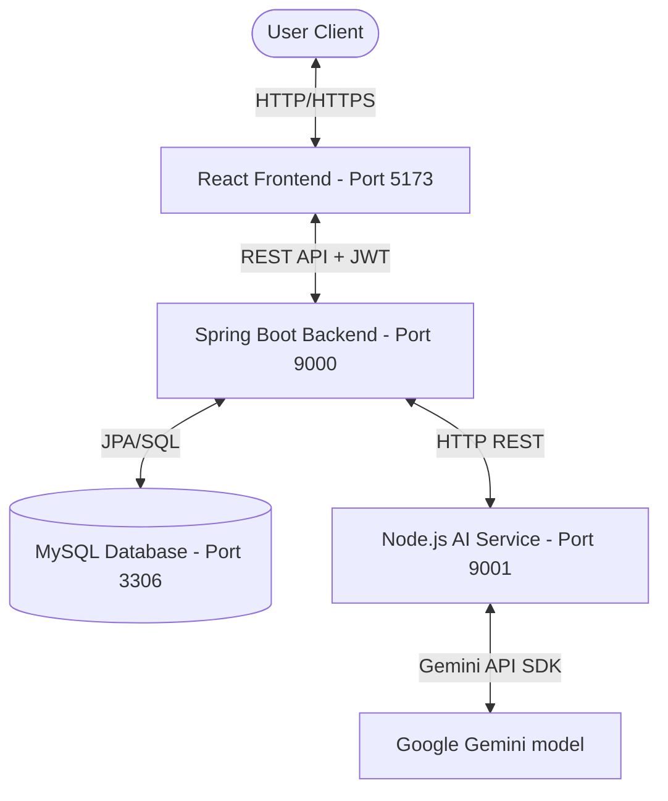

# Sri Tulja Bhavani Travels Billing Management System

An enterprise-grade, secure Billing and Fleet Management System tailored for Sri Tulja Bhavani Travels. This system manages bookings, generates print-ready billing invoices with number-to-words translations, parses unstructured billing records with generative AI, and yields real-time business and revenue analytics.

---

## 🏗️ System Architecture & Data Flow

The application splits responsibilities into four distinct layers:



1.  **Frontend (React/Vite)**: Interacts with the user, handles client-side routing, stores session JSON Web Tokens (JWT) locally, and makes async requests to the backend. It features an interactive **AI Billing Assistant** widget and an **AI Intelligence** insights sidebar.
2.  **Backend (Spring Boot)**: Exposes secured REST API endpoints, coordinates business logic, enforces JWT-based authentication and role authorization (`OWNER`, `MANAGER`, `EMPLOYEE`), and delegates natural language / billing parsing queries to the AI Service.
3.  **AI Service (Node.js/Express)**: A standalone service wrapping Google Gemini APIs. It provides semantic search caching, computes embeddings (using `text-embedding-004`), parses raw text to JSON, and handles conversational chats.
4.  **Database (MySQL)**: The persistence store. Spring Boot automatically manages updates to tables using Hibernate Object-Relational Mapping (ORM).

---

## 🛠️ Technology Stack & Ports

*   **Frontend**: React (18.2), Vite, TailwindCSS (4.0), Axios, Recharts, Lucide-React, Sonner, SweetAlert2. (Default Port: `5173`)
*   **Backend**: Java 21, Maven 3.9+, Spring Boot 3.2.0, Spring Security, Spring Data JPA, Hibernate, Dotenv. (Default Port: `9000`)
*   **AI Service**: Node.js, Express, Google Gen AI SDK. (Default Port: `9001`)
*   **Database**: MySQL Server 8.0+. (Default Port: `3306`)

---

## 🚀 Installation & Setup

### 1. Database Setup (MySQL)
1.  Ensure MySQL is running on port `3306`.
2.  Create the database:
    ```sql
    CREATE DATABASE travelbillingdb;
    ```
3.  The database schema will automatically initialize and update when the backend starts. Seeding files and backups can be managed using scripts located in the [database/scripts/](file:///e:/Project Folder/TravelBillingSystem/database/scripts) folder.

### 2. Standalone AI Service Setup
1.  Navigate to the `ai/` folder:
    ```bash
    cd ai
    ```
2.  Install dependencies:
    ```bash
    npm install
    ```
3.  Create your local `.env` file based on `.env.example`:
    ```bash
    cp .env.example .env
    ```
    Configure your `GEMINI_API_KEY` and preferred model settings.
4.  Start the service:
    *   **Development**: `npm run dev` (uses nodemon)
    *   **Production**: `npm start`

### 3. Backend Setup (Spring Boot)
1.  Navigate to the `backend/` folder:
    ```bash
    cd backend
    ```
2.  Create your local `.env` file based on `.env.example`:
    ```bash
    cp .env.example .env
    ```
    Set database details (`DB_URL`, `DB_USERNAME`, `DB_PASSWORD`), server port, your own `JWT_SECRET`, and the AI Service endpoint.
3.  Compile and packaging:
    ```bash
    mvn clean install -DskipTests
    ```
4.  Run the backend:
    ```bash
    mvn spring-boot:run
    ```

### 4. Frontend Setup (React/Vite)
1.  Navigate to the `frontend/` folder:
    ```bash
    cd frontend
    ```
2.  Install dependencies:
    ```bash
    npm install
    ```
3.  Create a local `.env` (optional) to point to the backend URL (default is `http://localhost:9000/api`):
    ```bash
    cp .env.example .env
    ```
4.  Start the dev server:
    ```bash
    npm run dev
    ```

---

## 🔒 Production Hardening & Configuration

In production environments, always override default developer configurations using environment variables.

### Environment Variable Matrix

| Variable | Location | Description | Default Fallback |
| :--- | :--- | :--- | :--- |
| `PORT` | Backend | Port number the backend server listens on | `9000` |
| `DB_URL` | Backend | JDBC connection string for MySQL | `jdbc:mysql://localhost:3306/travelbillingdb...` |
| `DB_USERNAME` | Backend | Database login username | `root` |
| `DB_PASSWORD` | Backend | Database login password | `root` |
| `JWT_SECRET` | Backend | Secure cryptographic signature key for JWT tokens | `travel-billing-default-secret-key-change-me-please-32chars` |
| `AI_SERVICE_URL`| Backend | Target endpoint for the Standalone AI service | `http://localhost:9001/api/ai` |
| `GEMINI_API_KEY`| AI Service / Backend | Secret API Key for Google Gemini integrations | *Required (No Default)* |
| `GEMINI_MODEL`  | AI Service / Backend | Target LLM version (e.g. `gemini-1.5-flash`) | `gemini-1.5-flash` / `gemini-2.0-flash` |
| `VITE_API_BASE_URL`| Frontend | Target endpoint URL for Axios requests | `http://localhost:9000/api` |

---

## 🛡️ Git Best Practices & Repository Security

To maintain a clean and secure repository history on GitHub, strictly follow these rules:

1.  **Do NOT Commit Secrets**: Never stage or push `.env` files, actual database backup SQL dumps, or target build artifacts.
2.  **Verify Git Status**: Always check what files are untracked before performing a git commit:
    ```bash
    git status
    ```
3.  **Global Gitignore Rules**: The root [.gitignore](file:///e:/Project Folder/TravelBillingSystem/.gitignore) is configured to automatically ignore:
    *   Development env configurations (`.env`, `.env.local`)
    *   Build artifacts (`target/`, `dist/`, `build/`)
    *   Dependencies folders (`node_modules/`)
    *   Local logs (`*.log`)
    *   Database dumps (`backups/*.sql`)
4.  **How to clean accidentally added files**: If you accidentally tracked a sensitive file:
    ```bash
    git rm --cached path/to/file.env
    git commit -m "chore: remove sensitive file from tracking"
    ```