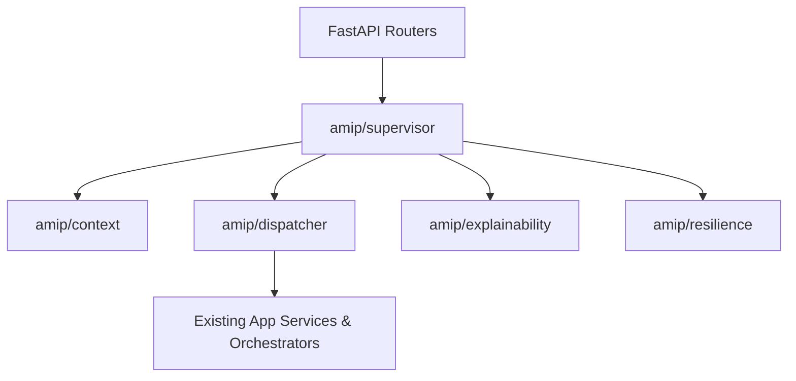

# Autonomous Multi-Agent Intelligence Platform (AMIP)
## Architectural Skeleton & Package Guide

---

## 1. Purpose

The **Autonomous Multi-Agent Intelligence Platform (AMIP)** is an enterprise platform layer built *above* the existing domain orchestrators (`CopilotOrchestrator`, `BulkImportService`, `PredictiveOrchestrator`, `ValidationOrchestrator`, `LearningOrchestrator`, `GraphOrchestrator`, `LabelingOrchestrator`).

Its primary objective is to transform procedural system execution into a coordinated, multi-agent intelligence ecosystem while maintaining **100% backward compatibility** with all existing REST endpoints, database schemas, and FastAPI routers.

---

## 2. Architecture Overview

AMIP acts as a non-invasive supervisory wrapper that routes tasks, shares state across engines, tracks decision provenance, and manages resilience without modifying underlying business or AI engine logic.

```
+-----------------------------------------------------------------------+
|                 FastAPI Routers & Client Interfaces                  |
+-----------------------------------------------------------------------+
                                   |
                                   v
+-----------------------------------------------------------------------+
|                    AMIP PLATFORM LAYER (This Package)                 |
|                                                                       |
|  [Supervisor] <---> [Context Blackboard] <---> [Resilience Controller]|
|        |                                              |               |
|        v                                              v               |
|  [Task Dispatcher] ------------------------> [Explainability Engine]  |
+-----------------------------------------------------------------------+
                                   |
                                   v
+-----------------------------------------------------------------------+
|             EXISTING DOMAIN ORCHESTRATORS (Preserved 100%)            |
|                                                                       |
|  * CopilotOrchestrator              * BulkImportService               |
|  * PredictiveOrchestrator           * ValidationOrchestrator          |
|  * LearningOrchestrator             * GraphOrchestrator               |
|  * LabelingOrchestrator             * ContextBuilder                  |
+-----------------------------------------------------------------------+
```

---

## 3. Package Responsibilities

| Package | Purpose |
|---|---|
| `amip/context/` | Thread-safe memory blackboard (`AMIPExecutionContext`) for sharing evidence across agents. |
| `amip/supervisor/` | Top-level supervisory agent (`AmipSupervisorAgent`) for task planning and goal delegation. |
| `amip/decision/` | Multi-agent confidence consensus and evaluation rules. |
| `amip/dispatcher/` | Event-driven task router and non-blocking dispatcher (`AmipTaskDispatcher`). |
| `amip/explainability/` | Decision provenance, confidence breakdowns, and bounding box evidence tracking. |
| `amip/resilience/` | Circuit breakers, exponential retries, and dead letter queue logging (`AmipResilienceController`). |
| `amip/models/` | Task DTOs, blackboard state models, and event contracts. |
| `amip/interfaces/` | Abstract base classes for agent components and tool adapters. |
| `amip/utils/` | Shared logging, timing, and tracing helper utilities. |
| `amip/exceptions/` | Standardized platform exception types. |
| `amip/tests/` | Unit and integration test suite placeholders for AMIP platform checkpoints. |

---

## 4. Future Platform Components (Phased Rollout)

- **`AmipSupervisorAgent`**: Manages goal decomposition and orchestrates multi-agent execution plans.
- **`AmipContextManager`**: Manages immutable metadata, raw evidence, and intermediate extracted state on the blackboard.
- **`AmipTaskDispatcher`**: Dispatches task events asynchronously or synchronously to domain orchestrators.
- **`AmipExplainabilityEngine`**: Constructs explainability reports for audit compliance.
- **`AmipResilienceController`**: Enforces fallback pathways during external API outages.

---

## 5. Execution Lifecycle

1. **Task Ingestion**: Incoming REST requests are converted into an `AMIPTask` DTO.
2. **Planning & Context Assembly**: `AmipSupervisorAgent` and `AmipContextManager` build the blackboard context.
3. **Task Dispatching**: `AmipTaskDispatcher` invokes domain orchestrators (`BulkImportService`, `CopilotOrchestrator`).
4. **Validation & Decision**: `ValidationOrchestrator` and `AmipDecisionEngine` compute confidence metrics.
5. **Explainability & Result Return**: `AmipExplainabilityEngine` attaches provenance metadata before response emission.

---

## 6. Dependency Diagram



---

*AMIP Architectural Skeleton Guide — Phase 9 Checkpoint 0*
