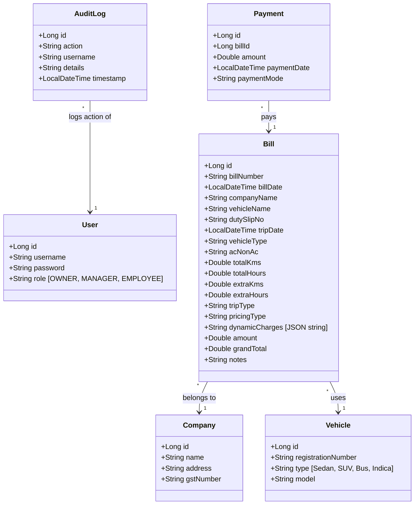

# System Design Document

This document describes the architectural details, database schemas, and interface contracts for the Sri Tulja Bhavani Travels Billing Management System.

---

## 1. Domain Entities

---

## 2. Dynamic Pricing Logic

The backend calculates the invoice total in `bills.py` based on a combination of base rates and dynamic adjustments:

$$\text{Grand Total} = \text{Base Amount} + \sum \text{Dynamic Charges}$$

Dynamic charges are custom line-item objects (e.g. *Toll*, *Parking*, *Driver Bata*, *Night Allowance*) that are extracted by Gemini during ingestion or manually added in the bill editor.

---

## 3. Microservice Orchestration

To maintain low latency and circumvent API rate limits:
1.  **AI Insights Cache**: Analytical reports and dashboard widgets request summaries once per day or upon major database changes. The microservice caches and serves mock responses in the event of Gemini API quota exhaustion.
2.  **Document Chunking**: Large Word invoices (exceeding 8,000 characters) are partitioned into separate page segments by the backend before dispatching to the AI model to guarantee prompt processing.
